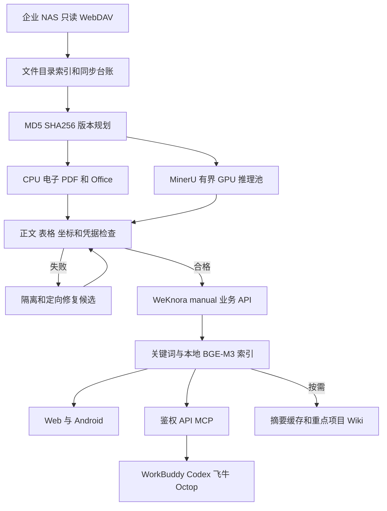

# 架构蓝图

CPU 文档通道、文件发现队列、MinerU 区域请求队列、WeKnora 内部任务队列分别统计，不能混为一个 pending 数值。解析完成也不等于向量索引可查，最终状态通过业务 API 核对。

原件在 NAS；不可变内容归档、解析结果与检查点在本地归档盘；有界临时页面位于 noswap tmpfs。SQLite 是同步状态台账，WeKnora 使用其自身数据库和向量存储，两者不是互相替代。

当前图中的原生电子 PDF 与扫描页分流已实现，混合页面的逐区域 CPU/GPU 组合仍受质量验收开关约束。CPU 图片补识别是补救分支，不替换主要 GPU 表格识别。
